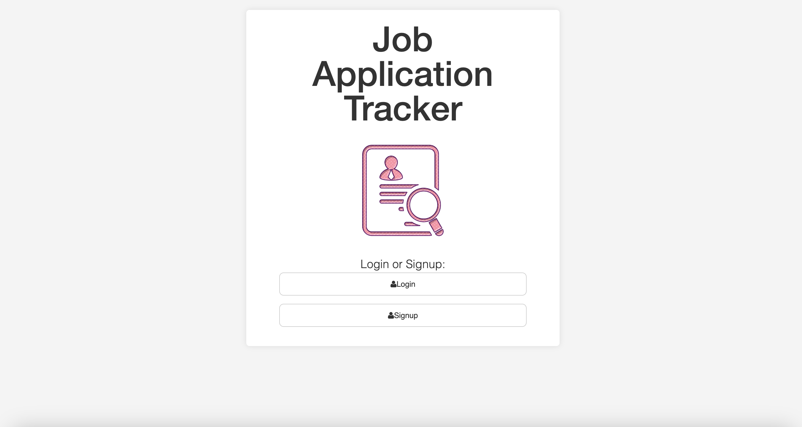
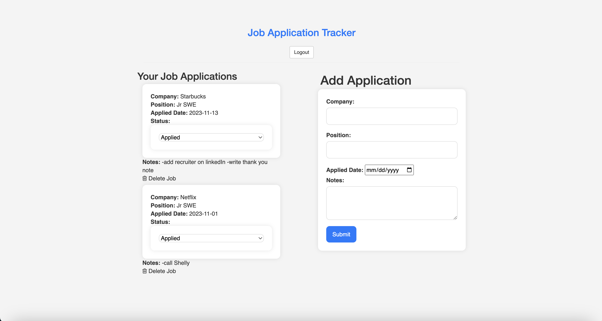

# Job Application Tracker
This app was developed so users can keep track of job applications.

## Installation

1. Clone repo
2. run `npm install`

## Usage

1. run `node server.js`
2. Navigate to `localhost:4040`

## Credit

Modified from Scotch.io's auth tutorial
# fullstack-auth

# Features
Add Job Applications: Users can add new job applications by providing details such as the company name, position, application date, and notes.
Track Application Status: Users can update the status of their job applications, indicating whether it's 'applied', 'in-progress', or 'completed'.
View and Manage Applications: Users can view a list of their job applications, including details and current status. They can also delete applications if needed.

## How It's Made:

**Tech used:** HTML, CSS, JavaScript, EJS, 
Frontend: HTML, CSS, JavaScript
Backend: Node.js, Express.js
Database: MongoDB

